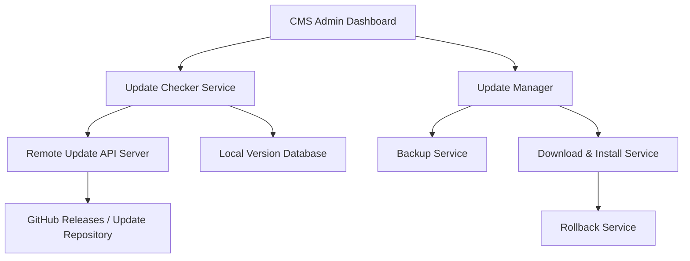

# CMS Upgrade System Using API - Complete Implementation Plan

## Overview

This document outlines a complete WordPress-style upgrade system for the CMS, allowing automatic updates for widgets, themes, and core files through a centralized API.

---

## System Architecture



---

## Database Schema

### 1. Plugin/Widget Versions Table

```sql
CREATE TABLE `plugin_versions` (
  `id` INT AUTO_INCREMENT PRIMARY KEY,
  `plugin_slug` VARCHAR(100) NOT NULL UNIQUE,
  `plugin_name` VARCHAR(255) NOT NULL,
  `plugin_type` ENUM('widget', 'core', 'theme', 'plugin') DEFAULT 'widget',
  `current_version` VARCHAR(20) NOT NULL,
  `latest_version` VARCHAR(20) DEFAULT NULL,
  `update_available` BOOLEAN DEFAULT FALSE,
  `auto_update` BOOLEAN DEFAULT FALSE,
  `last_checked` DATETIME DEFAULT NULL,
  `last_updated` DATETIME DEFAULT NULL,
  `file_path` VARCHAR(500) NOT NULL,
  `description` TEXT,
  `author` VARCHAR(100),
  `update_url` VARCHAR(500),
  `changelog_url` VARCHAR(500),
  `created_at` TIMESTAMP DEFAULT CURRENT_TIMESTAMP,
  `updated_at` TIMESTAMP DEFAULT CURRENT_TIMESTAMP ON UPDATE CURRENT_TIMESTAMP,
  INDEX `idx_plugin_type` (`plugin_type`),
  INDEX `idx_update_available` (`update_available`)
) ENGINE=InnoDB DEFAULT CHARSET=utf8mb4;
```

### 2. Update History Table

```sql
CREATE TABLE `update_history` (
  `id` INT AUTO_INCREMENT PRIMARY KEY,
  `plugin_slug` VARCHAR(100) NOT NULL,
  `from_version` VARCHAR(20),
  `to_version` VARCHAR(20) NOT NULL,
  `update_status` ENUM('pending', 'in_progress', 'success', 'failed', 'rolled_back') DEFAULT 'pending',
  `backup_path` VARCHAR(500),
  `error_message` TEXT,
  `started_at` DATETIME,
  `completed_at` DATETIME,
  `updated_by` INT,
  `created_at` TIMESTAMP DEFAULT CURRENT_TIMESTAMP,
  INDEX `idx_plugin_slug` (`plugin_slug`),
  INDEX `idx_update_status` (`update_status`),
  FOREIGN KEY (`updated_by`) REFERENCES `users`(`id`) ON DELETE SET NULL
) ENGINE=InnoDB DEFAULT CHARSET=utf8mb4;
```

### 3. Update Settings Table

```sql
CREATE TABLE `update_settings` (
  `id` INT AUTO_INCREMENT PRIMARY KEY,
  `setting_key` VARCHAR(100) NOT NULL UNIQUE,
  `setting_value` TEXT,
  `created_at` TIMESTAMP DEFAULT CURRENT_TIMESTAMP,
  `updated_at` TIMESTAMP DEFAULT CURRENT_TIMESTAMP ON UPDATE CURRENT_TIMESTAMP
) ENGINE=InnoDB DEFAULT CHARSET=utf8mb4;

-- Default settings
INSERT INTO `update_settings` (`setting_key`, `setting_value`) VALUES
('auto_check_enabled', '1'),
('check_interval_hours', '12'),
('auto_update_widgets', '0'),
('auto_update_themes', '0'),
('auto_update_core', '0'),
('update_api_url', 'https://api.yourcms.com/updates'),
('backup_before_update', '1'),
('max_backup_count', '5'),
('notification_email', ''),
('last_check_time', NULL);
```

---

## API Endpoints Structure

### Remote Update API Server

#### 1. Check for Updates
```
GET /api/v1/updates/check
Headers:
  - X-CMS-Version: 1.0.0
  - X-CMS-Site-URL: https://example.com
  - Authorization: Bearer {api_key}

Query Parameters:
  - plugins: comma-separated list of plugin slugs with versions
    Example: ?plugins=ProductGridWidget:1.0.0,FooterSectionWidget:1.2.0

Response:
{
  "success": true,
  "updates": [
    {
      "slug": "ProductGridWidget",
      "name": "Product Grid Widget",
      "type": "widget",
      "current_version": "1.0.0",
      "latest_version": "1.2.0",
      "download_url": "https://api.yourcms.com/downloads/ProductGridWidget-1.2.0.zip",
      "changelog_url": "https://api.yourcms.com/changelog/ProductGridWidget",
      "requires_cms_version": "1.0.0",
      "tested_up_to": "1.5.0",
      "release_date": "2026-01-08",
      "file_size": 45678,
      "checksum": "sha256:abc123...",
      "is_security_update": false,
      "auto_update_recommended": false
    }
  ],
  "core_update": {
    "available": true,
    "current_version": "1.0.0",
    "latest_version": "1.1.0",
    "download_url": "https://api.yourcms.com/downloads/core-1.1.0.zip",
    "is_critical": false
  }
}
```

#### 2. Get Plugin Details
```
GET /api/v1/plugins/{slug}

Response:
{
  "success": true,
  "plugin": {
    "slug": "ProductGridWidget",
    "name": "Product Grid Widget",
    "description": "Display products in a responsive grid layout",
    "author": "CMS Team",
    "author_url": "https://yourcms.com",
    "current_version": "1.2.0",
    "requires_cms_version": "1.0.0",
    "tested_up_to": "1.5.0",
    "rating": 4.8,
    "num_ratings": 150,
    "active_installs": 5000,
    "last_updated": "2026-01-08",
    "homepage": "https://yourcms.com/plugins/product-grid",
    "download_url": "https://api.yourcms.com/downloads/ProductGridWidget-1.2.0.zip",
    "screenshots": [
      "https://api.yourcms.com/screenshots/product-grid-1.png"
    ],
    "changelog": {
      "1.2.0": "Added pagination support, Fixed mobile layout",
      "1.1.0": "Performance improvements",
      "1.0.0": "Initial release"
    }
  }
}
```

#### 3. Download Plugin
```
GET /api/v1/downloads/{slug}/{version}
Headers:
  - Authorization: Bearer {api_key}

Response: Binary ZIP file
```

---

## Local CMS Implementation

### File Structure

```
/admin/
  /updates/
    index.php              # Updates dashboard
    check-updates.php      # Manual check trigger
    install-update.php     # Update installation handler
    rollback.php          # Rollback handler
    settings.php          # Update settings page

/api/
  update-checker.php      # Background update checker
  update-installer.php    # Update installation API
  update-info.php        # Get update information

/includes/
  UpdateManager.php       # Main update manager class
  BackupManager.php       # Backup/restore functionality
  VersionChecker.php      # Version comparison utilities

/backups/
  /plugins/              # Plugin backups
  /themes/               # Theme backups
  /core/                 # Core file backups
```

---

## Core Classes

### 1. UpdateManager.php

```php
<?php
class UpdateManager {
    private $pdo;
    private $apiUrl;
    private $apiKey;
    
    public function __construct($pdo) {
        $this->pdo = $pdo;
        $this->loadSettings();
    }
    
    /**
     * Check for available updates
     */
    public function checkForUpdates($force = false) {
        // Get last check time
        $lastCheck = $this->getSetting('last_check_time');
        $interval = (int)$this->getSetting('check_interval_hours', 12);
        
        if (!$force && $lastCheck) {
            $hoursSinceCheck = (time() - strtotime($lastCheck)) / 3600;
            if ($hoursSinceCheck < $interval) {
                return ['success' => true, 'message' => 'Recently checked'];
            }
        }
        
        // Get all installed plugins
        $plugins = $this->getInstalledPlugins();
        
        // Build query string
        $pluginList = [];
        foreach ($plugins as $plugin) {
            $pluginList[] = $plugin['slug'] . ':' . $plugin['version'];
        }
        
        // Call remote API
        $response = $this->callAPI('/updates/check', [
            'plugins' => implode(',', $pluginList)
        ]);
        
        if ($response['success']) {
            // Update database with available updates
            $this->processUpdateResponse($response['updates']);
            $this->setSetting('last_check_time', date('Y-m-d H:i:s'));
        }
        
        return $response;
    }
    
    /**
     * Install an update
     */
    public function installUpdate($pluginSlug, $version) {
        try {
            // Start transaction
            $this->pdo->beginTransaction();
            
            // Create update history record
            $historyId = $this->createUpdateHistory($pluginSlug, $version);
            
            // Create backup if enabled
            if ($this->getSetting('backup_before_update') == '1') {
                $backupPath = $this->createBackup($pluginSlug);
                $this->updateHistoryBackupPath($historyId, $backupPath);
            }
            
            // Download update
            $downloadPath = $this->downloadUpdate($pluginSlug, $version);
            
            // Extract and install
            $this->extractAndInstall($pluginSlug, $downloadPath);
            
            // Update version in database
            $this->updatePluginVersion($pluginSlug, $version);
            
            // Mark update as successful
            $this->updateHistoryStatus($historyId, 'success');
            
            $this->pdo->commit();
            
            return ['success' => true, 'message' => 'Update installed successfully'];
            
        } catch (Exception $e) {
            $this->pdo->rollBack();
            $this->updateHistoryStatus($historyId, 'failed', $e->getMessage());
            
            // Attempt rollback if backup exists
            if (isset($backupPath)) {
                $this->rollback($pluginSlug, $backupPath);
            }
            
            return ['success' => false, 'error' => $e->getMessage()];
        }
    }
    
    /**
     * Rollback to previous version
     */
    public function rollback($pluginSlug, $backupPath = null) {
        if (!$backupPath) {
            // Get latest backup
            $backupPath = $this->getLatestBackup($pluginSlug);
        }
        
        if (!$backupPath || !file_exists($backupPath)) {
            throw new Exception('Backup not found');
        }
        
        // Extract backup
        $zip = new ZipArchive();
        if ($zip->open($backupPath) === TRUE) {
            $plugin = $this->getPluginInfo($pluginSlug);
            $extractPath = dirname($plugin['file_path']);
            
            // Remove current version
            $this->removeDirectory($extractPath);
            
            // Extract backup
            $zip->extractTo($extractPath);
            $zip->close();
            
            return true;
        }
        
        throw new Exception('Failed to extract backup');
    }
    
    /**
     * Create backup of plugin
     */
    private function createBackup($pluginSlug) {
        $plugin = $this->getPluginInfo($pluginSlug);
        $sourcePath = dirname($plugin['file_path']);
        
        $backupDir = __DIR__ . '/../backups/plugins/' . $pluginSlug;
        if (!is_dir($backupDir)) {
            mkdir($backupDir, 0755, true);
        }
        
        $backupFile = $backupDir . '/' . $pluginSlug . '-' . $plugin['current_version'] . '-' . date('YmdHis') . '.zip';
        
        $zip = new ZipArchive();
        if ($zip->open($backupFile, ZipArchive::CREATE) === TRUE) {
            $this->addDirectoryToZip($zip, $sourcePath, basename($sourcePath));
            $zip->close();
            
            // Clean old backups
            $this->cleanOldBackups($backupDir);
            
            return $backupFile;
        }
        
        throw new Exception('Failed to create backup');
    }
    
    /**
     * Download update from remote server
     */
    private function downloadUpdate($pluginSlug, $version) {
        $downloadUrl = $this->apiUrl . '/downloads/' . $pluginSlug . '/' . $version;
        
        $tempDir = sys_get_temp_dir() . '/cms-updates';
        if (!is_dir($tempDir)) {
            mkdir($tempDir, 0755, true);
        }
        
        $tempFile = $tempDir . '/' . $pluginSlug . '-' . $version . '.zip';
        
        // Download file
        $ch = curl_init($downloadUrl);
        curl_setopt($ch, CURLOPT_RETURNTRANSFER, true);
        curl_setopt($ch, CURLOPT_FOLLOWLOCATION, true);
        curl_setopt($ch, CURLOPT_HTTPHEADER, [
            'Authorization: Bearer ' . $this->apiKey
        ]);
        
        $data = curl_exec($ch);
        $httpCode = curl_getinfo($ch, CURLINFO_HTTP_CODE);
        curl_close($ch);
        
        if ($httpCode !== 200) {
            throw new Exception('Download failed: HTTP ' . $httpCode);
        }
        
        file_put_contents($tempFile, $data);
        
        // Verify checksum if available
        // TODO: Implement checksum verification
        
        return $tempFile;
    }
    
    /**
     * Extract and install update
     */
    private function extractAndInstall($pluginSlug, $zipPath) {
        $plugin = $this->getPluginInfo($pluginSlug);
        $targetPath = dirname($plugin['file_path']);
        
        // Remove old version
        $this->removeDirectory($targetPath);
        
        // Extract new version
        $zip = new ZipArchive();
        if ($zip->open($zipPath) === TRUE) {
            $zip->extractTo(dirname($targetPath));
            $zip->close();
            
            // Clean up temp file
            unlink($zipPath);
            
            return true;
        }
        
        throw new Exception('Failed to extract update');
    }
    
    /**
     * Call remote API
     */
    private function callAPI($endpoint, $params = []) {
        $url = $this->apiUrl . $endpoint;
        if (!empty($params)) {
            $url .= '?' . http_build_query($params);
        }
        
        $ch = curl_init($url);
        curl_setopt($ch, CURLOPT_RETURNTRANSFER, true);
        curl_setopt($ch, CURLOPT_HTTPHEADER, [
            'Authorization: Bearer ' . $this->apiKey,
            'X-CMS-Version: ' . $this->getCMSVersion(),
            'X-CMS-Site-URL: ' . $this->getSiteURL()
        ]);
        
        $response = curl_exec($ch);
        $httpCode = curl_getinfo($ch, CURLINFO_HTTP_CODE);
        curl_close($ch);
        
        if ($httpCode !== 200) {
            return ['success' => false, 'error' => 'API call failed: HTTP ' . $httpCode];
        }
        
        return json_decode($response, true);
    }
    
    // Additional helper methods...
    private function getInstalledPlugins() { /* ... */ }
    private function processUpdateResponse($updates) { /* ... */ }
    private function createUpdateHistory($slug, $version) { /* ... */ }
    private function updateHistoryStatus($id, $status, $error = null) { /* ... */ }
    private function updatePluginVersion($slug, $version) { /* ... */ }
    private function getSetting($key, $default = null) { /* ... */ }
    private function setSetting($key, $value) { /* ... */ }
    private function loadSettings() { /* ... */ }
    private function getCMSVersion() { /* ... */ }
    private function getSiteURL() { /* ... */ }
    private function addDirectoryToZip($zip, $path, $zipPath) { /* ... */ }
    private function removeDirectory($dir) { /* ... */ }
    private function cleanOldBackups($dir) { /* ... */ }
}
```

---

## Admin Interface

### 1. Updates Dashboard (`admin/updates/index.php`)

```php
<?php
require_once '../includes/auth.php';
require_once '../includes/UpdateManager.php';

$updateManager = new UpdateManager($pdo);

// Check for updates if requested
if (isset($_GET['check'])) {
    $result = $updateManager->checkForUpdates(true);
}

// Get available updates
$stmt = $pdo->query("
    SELECT * FROM plugin_versions 
    WHERE update_available = 1 
    ORDER BY plugin_type, plugin_name
");
$availableUpdates = $stmt->fetchAll();

// Get update history
$stmt = $pdo->query("
    SELECT * FROM update_history 
    ORDER BY created_at DESC 
    LIMIT 10
");
$updateHistory = $stmt->fetchAll();
?>

<!DOCTYPE html>
<html>
<head>
    <title>Updates - CMS Admin</title>
    <link rel="stylesheet" href="../assets/css/admin.css">
</head>
<body>
    <div class="admin-container">
        <h1>Updates</h1>
        
        <div class="update-actions">
            <button onclick="checkUpdates()" class="btn btn-primary">
                <i class="fa fa-sync"></i> Check for Updates
            </button>
            <a href="settings.php" class="btn btn-secondary">
                <i class="fa fa-cog"></i> Update Settings
            </a>
        </div>
        
        <?php if (count($availableUpdates) > 0): ?>
            <div class="updates-available">
                <h2>Available Updates (<?php echo count($availableUpdates); ?>)</h2>
                
                <table class="updates-table">
                    <thead>
                        <tr>
                            <th>Plugin</th>
                            <th>Current Version</th>
                            <th>New Version</th>
                            <th>Type</th>
                            <th>Actions</th>
                        </tr>
                    </thead>
                    <tbody>
                        <?php foreach ($availableUpdates as $update): ?>
                            <tr>
                                <td>
                                    <strong><?php echo htmlspecialchars($update['plugin_name']); ?></strong>
                                    <br>
                                    <small><?php echo htmlspecialchars($update['description']); ?></small>
                                </td>
                                <td><?php echo htmlspecialchars($update['current_version']); ?></td>
                                <td>
                                    <strong><?php echo htmlspecialchars($update['latest_version']); ?></strong>
                                    <?php if ($update['changelog_url']): ?>
                                        <a href="<?php echo htmlspecialchars($update['changelog_url']); ?>" target="_blank">
                                            <i class="fa fa-list"></i> Changelog
                                        </a>
                                    <?php endif; ?>
                                </td>
                                <td><?php echo htmlspecialchars($update['plugin_type']); ?></td>
                                <td>
                                    <button onclick="installUpdate('<?php echo $update['plugin_slug']; ?>', '<?php echo $update['latest_version']; ?>')" 
                                            class="btn btn-sm btn-success">
                                        <i class="fa fa-download"></i> Update Now
                                    </button>
                                </td>
                            </tr>
                        <?php endforeach; ?>
                    </tbody>
                </table>
            </div>
        <?php else: ?>
            <div class="no-updates">
                <i class="fa fa-check-circle"></i>
                <p>All plugins are up to date!</p>
            </div>
        <?php endif; ?>
        
        <div class="update-history">
            <h2>Recent Updates</h2>
            <table class="history-table">
                <thead>
                    <tr>
                        <th>Plugin</th>
                        <th>Version</th>
                        <th>Status</th>
                        <th>Date</th>
                        <th>Actions</th>
                    </tr>
                </thead>
                <tbody>
                    <?php foreach ($updateHistory as $history): ?>
                        <tr>
                            <td><?php echo htmlspecialchars($history['plugin_slug']); ?></td>
                            <td>
                                <?php echo htmlspecialchars($history['from_version']); ?> 
                                → 
                                <?php echo htmlspecialchars($history['to_version']); ?>
                            </td>
                            <td>
                                <span class="status-badge status-<?php echo $history['update_status']; ?>">
                                    <?php echo htmlspecialchars($history['update_status']); ?>
                                </span>
                            </td>
                            <td><?php echo date('M d, Y H:i', strtotime($history['created_at'])); ?></td>
                            <td>
                                <?php if ($history['update_status'] === 'success' && $history['backup_path']): ?>
                                    <button onclick="rollback('<?php echo $history['plugin_slug']; ?>', '<?php echo $history['backup_path']; ?>')" 
                                            class="btn btn-sm btn-warning">
                                        <i class="fa fa-undo"></i> Rollback
                                    </button>
                                <?php endif; ?>
                            </td>
                        </tr>
                    <?php endforeach; ?>
                </tbody>
            </table>
        </div>
    </div>
    
    <script>
        function checkUpdates() {
            window.location.href = '?check=1';
        }
        
        function installUpdate(slug, version) {
            if (!confirm(`Install update for ${slug} to version ${version}?`)) {
                return;
            }
            
            // Show loading
            const btn = event.target;
            btn.disabled = true;
            btn.innerHTML = '<i class="fa fa-spinner fa-spin"></i> Installing...';
            
            fetch('install-update.php', {
                method: 'POST',
                headers: {'Content-Type': 'application/json'},
                body: JSON.stringify({slug, version})
            })
            .then(r => r.json())
            .then(data => {
                if (data.success) {
                    alert('Update installed successfully!');
                    location.reload();
                } else {
                    alert('Update failed: ' + data.error);
                    btn.disabled = false;
                    btn.innerHTML = '<i class="fa fa-download"></i> Update Now';
                }
            });
        }
        
        function rollback(slug, backupPath) {
            if (!confirm(`Rollback ${slug} to previous version?`)) {
                return;
            }
            
            fetch('rollback.php', {
                method: 'POST',
                headers: {'Content-Type': 'application/json'},
                body: JSON.stringify({slug, backupPath})
            })
            .then(r => r.json())
            .then(data => {
                if (data.success) {
                    alert('Rollback successful!');
                    location.reload();
                } else {
                    alert('Rollback failed: ' + data.error);
                }
            });
        }
    </script>
</body>
</html>
```

---

## Automatic Update Checker (Cron Job)

### `api/update-checker.php`

```php
<?php
// This file should be called by a cron job every X hours
require_once '../includes/db.php';
require_once '../includes/UpdateManager.php';

$pdo = getDBConnection();
$updateManager = new UpdateManager($pdo);

// Check if auto-check is enabled
$stmt = $pdo->prepare("SELECT setting_value FROM update_settings WHERE setting_key = 'auto_check_enabled'");
$stmt->execute();
$autoCheck = $stmt->fetchColumn();

if ($autoCheck != '1') {
    exit('Auto-check disabled');
}

// Check for updates
$result = $updateManager->checkForUpdates();

// Send notification email if updates available
if ($result['success'] && !empty($result['updates'])) {
    $stmt = $pdo->prepare("SELECT setting_value FROM update_settings WHERE setting_key = 'notification_email'");
    $stmt->execute();
    $email = $stmt->fetchColumn();
    
    if ($email) {
        $subject = 'CMS Updates Available';
        $message = count($result['updates']) . ' updates are available for your CMS.';
        mail($email, $subject, $message);
    }
}

echo json_encode($result);
```

**Cron Job Setup:**
```bash
# Add to crontab (check every 12 hours)
0 */12 * * * /usr/bin/php /path/to/cms/api/update-checker.php
```

---

## Security Considerations

1. **API Authentication**
   - Use API keys for authentication
   - Implement rate limiting
   - Use HTTPS only

2. **File Verification**
   - Verify checksums (SHA-256) of downloaded files
   - Validate ZIP file integrity
   - Scan for malicious code

3. **Backup Strategy**
   - Always backup before updates
   - Keep multiple backup versions
   - Test restore functionality

4. **Permissions**
   - Restrict update permissions to admin users
   - Log all update activities
   - Implement rollback capabilities

5. **Update Validation**
   - Check CMS version compatibility
   - Verify plugin dependencies
   - Test in staging environment first

---

## Implementation Phases

### Phase 1: Foundation (Week 1)
- [ ] Create database tables
- [ ] Implement UpdateManager class
- [ ] Create basic admin interface
- [ ] Set up version tracking

### Phase 2: API Integration (Week 2)
- [ ] Build remote API server
- [ ] Implement update checker
- [ ] Create download mechanism
- [ ] Add checksum verification

### Phase 3: Backup & Rollback (Week 3)
- [ ] Implement backup system
- [ ] Create rollback functionality
- [ ] Add backup cleanup
- [ ] Test restore process

### Phase 4: Automation (Week 4)
- [ ] Set up cron jobs
- [ ] Implement auto-updates
- [ ] Add email notifications
- [ ] Create update logs

### Phase 5: Polish & Testing (Week 5)
- [ ] Add progress indicators
- [ ] Implement error handling
- [ ] Security audit
- [ ] Performance testing
- [ ] Documentation

---

## Configuration Example

### `config/updates.php`

```php
<?php
return [
    'api_url' => 'https://api.yourcms.com',
    'api_key' => 'your-api-key-here',
    'auto_check' => true,
    'check_interval' => 12, // hours
    'auto_update_widgets' => false,
    'auto_update_themes' => false,
    'auto_update_core' => false,
    'backup_enabled' => true,
    'max_backups' => 5,
    'notification_email' => 'admin@example.com',
    'allowed_update_types' => ['widget', 'theme', 'plugin', 'core'],
    'staging_mode' => false,
];
```

---

## Testing Checklist

- [ ] Manual update check works
- [ ] Automatic update check runs on schedule
- [ ] Updates download correctly
- [ ] Backups are created before updates
- [ ] Updates install successfully
- [ ] Rollback restores previous version
- [ ] Email notifications are sent
- [ ] Update history is logged
- [ ] Permissions are enforced
- [ ] Error handling works correctly

---

## Future Enhancements

1. **Staged Rollouts** - Test updates on subset of sites first
2. **A/B Testing** - Compare performance before/after updates
3. **Dependency Management** - Handle plugin dependencies automatically
4. **Update Scheduling** - Schedule updates for specific times
5. **Bulk Updates** - Update multiple plugins at once
6. **Update Preview** - Preview changes before installing
7. **Marketplace Integration** - Browse and install new plugins
8. **License Management** - Handle premium plugin licenses
9. **Update Analytics** - Track update success rates
10. **Multi-site Support** - Manage updates across multiple sites

---

## Conclusion

This upgrade system provides a robust, WordPress-style update mechanism for your CMS. It includes automatic checking, one-click updates, backup/rollback capabilities, and comprehensive logging.

The system is designed to be:
- **Secure** - With API authentication and file verification
- **Reliable** - With automatic backups and rollback
- **User-friendly** - With simple admin interface
- **Extensible** - Easy to add new features

Start with Phase 1 and progressively implement each phase for a complete update system.
